# WFGameAI 报告生成系统详细文档

> 🎯 **专为 AI 工具优化的报告系统完整指南**

## 📋 系统概览

WFGameAI 报告生成系统是一个双层报告架构，包含设备级详细报告和汇总级概览报告。本文档为 AI 开发助手提供完整的系统理解和问题解决指南。

### 核心特性

- ✅ **设备报告**: 详细记录单个设备的测试过程和截图
- ✅ **汇总报告**: 统计所有设备的测试结果和成功率
- ✅ **截图集成**: 完整的截图捕获、处理和显示
- ✅ **模板系统**: 基于 Jinja2 的灵活模板渲染
- ✅ **相对路径**: 正确的目录间链接关系

---

> ⚙️ **配置文件路径变量（config.ini [devices_report_paths] 节）**
> ```ini
# 设备回放后生成报告目录
device_replay_reports_dir = ${server_dir}\staticfiles\reports

# 设备回放报告生成-静态资源目录
report_static_url = ${device_replay_reports_dir}\static

# 设备回放报告模版
template_dir = ${device_replay_reports_dir}\templates

# 单设备报告目录
single_device_reports_dir = ${device_replay_reports_dir}\ui_run\WFGameAI.air\log

# 多设备汇总报告目录
summary_reports_dir = ${device_replay_reports_dir}\summary_reports
```


## 🗂️ 目录结构与文件关系

### 完整目录树（2025-07更新版）

```
wfgame-ai-server/
└── ${device_replay_reports_dir}/  # 报告根目录（config.ini 定义）
    ├── ui_run/                    # 设备报告根目录
    │   └── WFGameAI.air/          # Airtest项目目录
    │       └── log/               # 设备报告存储目录（必须保留）
    │           ├── [设备序列号_时间戳]/  # 设备专属目录（每个设备，每次运行，只创建一个）
    │           │   ├── log.html   # 设备HTML报告，必须存在。使用 log_template.html 模板渲染
    │           │   ├── log.txt    # 原始JSON日志，必须存在
    │           │   ├── script.py  # 执行脚本（json文件）备份，必须存在
    │           │   ├── [时间戳].jpg      # 截图文件，直接存放，多张
    │           │   └── [时间戳]_small.jpg # 缩略图文件，直接存放，多张
    │           │
    │           └── multi_device_replay_[时间戳]/  # 多设备临时目录
    │               ├── [设备序列号].result.json   # 设备执行结果
    │               └── [其他临时文件]             # 执行过程中的临时文件
    │
    ├── summary_reports/                # 汇总报告存储目录
    │   └── summary_report_[时间戳].html # 汇总HTML报告，每批次只生成一份。使用 summary_template.html 模板渲染
    │
    └── templates/                 # 报告模板目录
        ├── log_template.html      # 单设备报告模板
        └── summary_template.html  # 汇总报告模板
```

### 报告生成系统核心文件

```
wfgame-ai-server/
├── apps/
│   ├── reports/                    # 报告管理应用
│   │   ├── views.py                # 报告Web API接口
│   │   ├── report_generator.py     # 报告生成器核心类
│   │   ├── report_hooks.py         # 报告生成钩子
│   │   ├── report_config.py        # 报告配置管理
│   │   └── staticfiles/            # 报告静态资源
│   │
│   └── scripts/
│       ├── action_processor.py     # 操作处理器（包含截图生成）
│       ├── replay_script.py        # 回放脚本（触发报告生成）
│       └── multi_device_replayer.py # 多设备回放器
│
├── create_integrated_reports.py    # 集成报告生成工具
└── generate_summary_from_logs.py   # 报告汇总生成工具
```

⚠️ **重要说明**：
- ✅ 必须保留 `log/` 子目录结构
- ✅ 每个设备，每次运行只创建一个专属目录，所有文件（截图、log.html等）直接存放在此目录下
- ✅ 设备目录命名格式：`设备序列号_YYYY-MM-DD-HH-MM-SS`
- ✅ `multi_device_replay_[时间戳]`是临时目录，不应存放最终报告文件
- ✅ 相对路径引用使用直接文件名：`[时间戳].jpg`（无log/前缀）
- ✅ 报告生成由`report_generator.py`中的ReportGenerator类负责核心逻辑
- ✅ 集成报告生成功能由`create_integrated_reports.py`提供


### 关键文件作用说明

| 文件/目录               | 作用                         | AI 修改频率 | 常见问题                   |
| ----------------------- | ---------------------------- | ----------- | -------------------------- |
| `log.txt`               | 存储设备执行的原始 JSON 日志 | 低          | 格式错误、缺失 screen 字段 |
| `log.html`              | 设备测试的可视化报告         | 中          | 截图不显示、模板渲染失败   |
| `summary_report_*.html` | 所有设备的汇总报告           | 高          | 链接错误、统计数据错误     |
| `[时间戳].jpg`          | 操作步骤的截图               | 低          | 文件不存在、路径错误       |
| `[时间戳]_small.jpg`    | 缩略图用于快速导航           | 低          | 生成失败、尺寸问题         |

---

## 🔄 数据流程与生成逻辑

### 完整数据流



### 多设备执行流程

```mermaid
graph TD
    A[启动多设备测试] --> B[创建临时目录multi_device_replay_时间戳]
    B --> C[为每个设备启动子进程]
    C --> D[子进程执行测试]
    D --> E[检测到临时目录]
    E --> F[创建设备专属目录]
    F --> G[保存截图到设备专属目录]
    G --> H[生成设备HTML报告]
    H --> I[写入设备执行结果到临时目录]
    I --> J[主进程等待所有设备完成]
    J --> K[主进程收集所有设备报告]
    K --> L[生成唯一汇总报告]
```



### 🚨 汇总报告生成逻辑

**正确行为**：
- 只在**最后一个设备完成后**生成**一个**汇总报告
- 该报告包含**所有设备**的结果
- 汇总报告生成时机：所有设备测试完成后


### 关键数据结构

#### 1. log.txt JSON 格式 (AI 必须理解)

```json
{
  "tag": "function",
  "depth": 1,
  "time": 1750313445.97594,
  "data": {
    "name": "touch",
    "call_args": { "pos": [540, 1200] },
    "start_time": 1750313445.97594,
    "ret": true,
    "end_time": 1750313446.97594,
    "screen": {
      "src": "1750313445975.png", // 🎯 HTML模板使用的相对路径
      "_filepath": "/full/path/to/screenshot", // 🎯 文件系统绝对路径
      "thumbnail": "1750313445975_small.png", // 🎯 缩略图相对路径
      "resolution": [1080, 2400], // 设备分辨率
      "pos": [540, 1200], // 点击位置坐标
      "vector": [0, 0], // 移动向量
      "confidence": 0.95, // AI检测置信度
      "rect": [490, 1150, 100, 100] // 检测区域 [x, y, w, h]
    }
  }
}
```

#### 2. 设备报告数据结构

```javascript
// log.html 中的 JavaScript 数据
data = {
  steps: [
    // 🎯 测试步骤数组
    {
      title: "点击登录按钮", // 步骤描述
      time: 1750313445.97594, // 执行时间戳
      status: "success", // 执行状态: success/fail
      index: 0, // 步骤索引
      duration: "1.000s", // 执行时长
      code: {
        name: "touch",
        args: [{ key: "pos", value: "[540, 1200]" }],
      },
      screen: {
        // 🎯 截图信息
        src: "1750313445975.jpg", // 主截图路径
        thumbnail: "1750313445975_small.jpg", // 缩略图路径
        resolution: [1080, 2400], // 分辨率
        pos: [540, 1200], // 点击位置
        confidence: 0.95, // 置信度
        rect: [490, 1150, 100, 100], // 检测框
      },
    },
  ],
  info: {
    name: "TestDevice_2025-06-19", // 设备名称
    title: "设备测试报告", // 报告标题
    devices: {}, // 设备信息
  },
};
```

#### 3. 汇总报告数据结构

```javascript
// summary_report_*.html 中的数据
data = {
  timestamp: "2025-06-19 14:10:45", // 🎯 报告生成时间
  total: 5, // 🎯 总设备数
  success: 4, // 🎯 成功设备数
  passed: 3, // 🎯 通过设备数
  success_rate: "80.0%", // 🎯 成功率(字符串)
  pass_rate: "60.0%", // 🎯 通过率(字符串)
  success_percent: 80.0, // 🎯 成功率(数值,用于进度条)
  pass_percent: 60.0, // 🎯 通过率(数值,用于进度条)
  devices: [
    // 🎯 设备列表
    {
      name: "OnePlus-KB2000_2025-06-19", // 设备名称
      passed: true, // 是否通过测试
      success: true, // 是否执行成功
      report: "../ui_run/WFGameAI.air/log/OnePlus-KB2000_2025-06-19/log.html", // 🎯 设备报告链接(相对路径)
    },
  ],
  scripts: [
    // 🎯 执行的脚本信息
    {
      path: "test_login.json",
      loop_count: 1,
      max_duration: 300,
    },
  ],
};
```

---

## 🔧 核心组件详解

### 1. ActionProcessor (截图处理核心)

**文件位置**: `apps/scripts/action_processor.py`

#### 关键方法: `_create_unified_screen_object`

```python
def _create_unified_screen_object(self, log_dir, pos_list=None, confidence=0.85, rect_info=None):
    """
    创建统一的screen对象，包含截图和元数据

    🎯 AI修改要点:
    1. 确保截图文件实际保存成功
    2. 相对路径格式必须与HTML模板匹配
    3. screen对象必须包含所有必需字段
    4. 缩略图生成不能失败
    5. 多设备模式下需要将截图保存到设备专属目录
    """
    try:
        # 检查是否为多设备临时目录
        if "multi_device_replay" in str(log_dir):
            # 获取设备序列号
            device_serial = getattr(self.device, 'serial', self.device_name)

            # 构建设备专属目录
            device_dir = os.path.join(
                os.path.dirname(os.path.dirname(log_dir)),  # 上两级目录
                f"{device_serial}_{datetime.now().strftime('%Y-%m-%d-%H-%M-%S')}"
            )

            # 确保设备目录存在
            os.makedirs(device_dir, exist_ok=True)

            # 更新log_dir为设备专属目录
            log_dir = device_dir

        # 生成时间戳文件名
        timestamp = time.time()
        screenshot_filename = f"{int(timestamp * 1000)}.jpg"
        thumbnail_filename = f"{int(timestamp * 1000)}_small.jpg"

        # 🎯 关键: 设置文件路径
        screenshot_path = os.path.join(log_dir, screenshot_filename)
        thumbnail_path = os.path.join(log_dir, thumbnail_filename)

        # 截图捕获逻辑
        screenshot_success = self._capture_screenshot(screenshot_path)
        thumbnail_success = self._create_thumbnail(screenshot_path, thumbnail_path)

        if not screenshot_success:
            print(f"❌ 截图保存失败: {screenshot_path}")
            return None

        # 🎯 返回完整的screen对象
        return {
            "src": screenshot_filename,      # HTML模板使用的相对路径
            "_filepath": screenshot_path,    # 文件系统绝对路径
            "thumbnail": thumbnail_filename, # 缩略图相对路径
            "resolution": [1080, 2400],      # 设备分辨率
            "pos": pos_list or [],           # 点击位置
            "vector": [0, 0],                # 移动向量
            "confidence": confidence,        # 检测置信度
            "rect": rect_info or []          # 检测区域
        }

    except Exception as e:
        print(f"❌ 创建screen对象失败: {str(e)}")
        return None
```

### 2. ReportGenerator (报告生成核心)

**文件位置**: `apps/reports/report_generator.py`

#### 关键方法: `generate_summary_report`

```python
def generate_summary_report(self, device_report_dirs: List[Path], scripts: List[Dict]) -> Optional[Path]:
    """
    生成汇总报告

    🎯 AI修改要点:
    1. 模板路径必须正确
    2. 数据结构必须完整
    3. 文件保存路径要规范
    4. 错误处理要完善
    """
    try:
        print(f"📊 开始生成汇总报告，设备数量: {len(device_report_dirs)}")

        # 🎯 关键: 准备完整的数据结构
        summary_data = self._prepare_summary_data(device_report_dirs, scripts)

        # 🎯 关键: 使用正确的模板路径
        template_path = self.report_manager.reports_root / "templates" / "summary_template.html"
        if not template_path.exists():
            raise FileNotFoundError(f"模板文件不存在: {template_path}")

        # 渲染模板
        html_content = self._render_summary_template(summary_data)

        # 🎯 关键: 使用正确的命名格式和保存路径
        summary_reports_dir = self.report_manager.reports_root / "summary_reports"
        summary_reports_dir.mkdir(parents=True, exist_ok=True)

        timestamp = datetime.now().strftime("%Y-%m-%d-%H-%M-%S")
        summary_file = summary_reports_dir / f"summary_report_{timestamp}.html"

        with open(summary_file, 'w', encoding='utf-8') as f:
            f.write(html_content)

        print(f"✅ 汇总报告生成成功: {summary_file}")
        return summary_file

    except Exception as e:
        print(f"❌ 生成汇总报告失败: {e}")
        return None
```

#### 关键方法: `_prepare_summary_data`

```python
def _prepare_summary_data(self, device_report_dirs: List[Path], scripts: List[Dict]) -> Dict:
    """
    准备汇总报告数据

    🎯 AI修改要点:
    1. 统计计算必须准确
    2. 设备链接路径必须正确
    3. 数据结构必须完整
    4. 字段类型必须匹配模板期望
    """
    try:
        devices = []
        total_devices = len(device_report_dirs)
        success_devices = 0
        passed_devices = 0

        for device_dir in device_report_dirs:
            device_name = device_dir.name

            # 解析设备状态
            steps = self._parse_log_file(device_dir)
            device_steps = len(steps)
            device_success = len([s for s in steps if s.get("status") == "success"])
            device_failed = len([s for s in steps if s.get("status") == "fail"])
            device_passed = device_failed == 0

            # 统计计算
            if device_success > 0:
                success_devices += 1
            if device_passed:
                passed_devices += 1

            # 🎯 关键: 设备报告链接使用正确的相对路径
            # 从 summary_reports/ 到 ui_run/WFGameAI.air/log/{device_name}/
            device_report_link = f"../ui_run/WFGameAI.air/log/{device_name}/log.html"

            devices.append({
                "name": device_name,
                "passed": device_passed,      # 模板需要的字段
                "success": device_success > 0, # 模板需要的字段
                "report": device_report_link,  # 🎯 正确的相对路径
                "steps": device_steps,
                "success_count": device_success,
                "failed_count": device_failed
            })

        # 🎯 关键: 计算各种比率
        success_rate = (success_devices / max(total_devices, 1)) * 100
        pass_rate = (passed_devices / max(total_devices, 1)) * 100

        # 🎯 关键: 返回模板需要的完整数据结构
        return {
            "title": "WFGameAI 测试汇总报告",
            "timestamp": datetime.now().strftime("%Y-%m-%d %H:%M:%S"),
            "generation_time": datetime.now().strftime("%Y-%m-%d %H:%M:%S"),

            # 设备统计
            "total_devices": total_devices,
            "total": total_devices,        # 模板字段
            "success": success_devices,
            "passed": passed_devices,

            # 比率信息(模板需要的格式)
            "success_rate": f"{success_rate:.1f}%",    # 字符串格式
            "pass_rate": f"{pass_rate:.1f}%",          # 字符串格式
            "success_percent": success_rate,           # 数值格式(进度条)
            "pass_percent": pass_rate,                 # 数值格式(进度条)

            # 设备和脚本信息
            "devices": devices,
            "scripts": scripts or [],
            "static_root": self.config.report_static_url
        }

    except Exception as e:
        print(f"❌ 准备汇总数据失败: {e}")
        raise e
```

### 3. ReportManager (路径管理)

**文件位置**: `apps/reports/report_manager.py`

```python
class ReportManager:
    """报告路径和配置管理"""

    def __init__(self):
        self.reports_root = Path(settings.BASE_DIR) / "staticfiles" / "reports"

    @property
    def ui_run_dir(self):
        """设备报告存储目录"""
        return self.reports_root / "ui_run" / "WFGameAI.air" / "log"

    @property
    def summary_reports_dir(self):
        """汇总报告存储目录"""
        return self.reports_root / "summary_reports"

    @property
    def templates_dir(self):
        """模板文件目录"""
        return self.reports_root / "templates"
```

---

## 🎯 常见问题与解决方案

### 1. 截图不显示问题

**症状**: HTML 报告中截图显示为空白或 404 错误

**根本原因**:

- screen 对象的 src 字段路径格式错误
- 截图文件没有实际保存成功
- 相对路径与 HTML 模板期望不匹配
- 截图错误保存到多设备临时目录而非设备专属目录

**解决方案**:

```python
# 在 action_processor.py 中修复
def _create_unified_screen_object(self, log_dir, pos_list=None, confidence=0.85, rect_info=None):
    # 检查是否为多设备临时目录
    if "multi_device_replay" in str(log_dir):
        # 获取设备序列号
        device_serial = getattr(self.device, 'serial', self.device_name)

        # 构建设备专属目录
        device_dir = os.path.join(
            os.path.dirname(os.path.dirname(log_dir)),  # 上两级目录
            f"{device_serial}_{datetime.now().strftime('%Y-%m-%d-%H-%M-%S')}"
        )

        # 更新log_dir为设备专属目录
        log_dir = device_dir

    # 确保使用正确的相对路径格式
    screenshot_filename = f"{int(time.time() * 1000)}.jpg"  # ✅ 正确格式

    # 确保文件实际保存
    screenshot_path = os.path.join(log_dir, screenshot_filename)
    screenshot_success = self._capture_screenshot(screenshot_path)
    if not screenshot_success:
        print(f"❌ 截图保存失败: {screenshot_path}")
        return None  # 必须返回None而不是空对象
```

### 5. 截图保存位置错误

**症状**: 设备报告中的图片链接无效，显示"image not found"

**根本原因**:
- 截图被错误地保存到了多设备临时目录(`multi_device_replay_[timestamp]`)中
- 而不是保存到各设备的专属报告目录(`[device_serial]_[timestamp]`)中
- 导致单设备报告HTML中引用的图片路径指向错误位置

**解决方案**:
- 在`action_processor.py`中的`_create_unified_screen_object`方法中添加检测和修正逻辑
- 检查log_dir是否包含"multi_device_replay"，如果是则修正为设备专属目录
- 确保截图保存到正确的设备目录中

**代码实现**:
```python
# 在_create_unified_screen_object方法中
if "multi_device_replay" in str(log_dir):
    # 获取设备序列号
    device_serial = getattr(self.device, 'serial', self.device_name)

    # 构建正确的设备专属目录路径
    device_dir = os.path.join(
        os.path.dirname(os.path.dirname(log_dir)),  # 上两级目录
        f"{device_serial}_{datetime.now().strftime('%Y-%m-%d-%H-%M-%S')}"
    )

    # 确保设备专属目录存在
    os.makedirs(device_dir, exist_ok=True)

    # 更新log_dir为设备专属目录
    log_dir = device_dir
```

### 6. 单设备报告路径问题

**症状**: 单设备报告URL使用硬编码路径，而不是从配置中获取

**根本原因**:
- 在`report_manager.py`中生成的报告URL没有正确使用配置中的`single_device_reports_dir`
- 导致报告URL使用硬编码路径，不符合配置要求

**解决方案**:
- 修改`report_manager.generate_report_urls`方法，确保使用配置中的路径
- 在`replay_script.py`中使用`REPORT_MANAGER.generate_report_urls`获取正确的URL

### 2. 汇总报告设备链接错误

**症状**: 点击汇总报告中的设备链接返回 404 错误

**根本原因**:

- 设备报告链接使用了错误的相对路径
- 目录结构理解错误

**AI 修复方案**:

```python
# 🔧 在 report_generator.py 的 _prepare_summary_data 中修复
def _prepare_summary_data(self, device_report_dirs: List[Path], scripts: List[Dict]) -> Dict:
    for device_dir in device_report_dirs:
        device_name = device_dir.name

        # ✅ 正确的相对路径
        device_report_link = f"{single_device_reports_dir}/{device_name}/log.html"

        # ❌ 错误的路径格式
        # device_report_link = f"{device_name}/log.html"  # 缺少目录层级
        # device_report_link = f"/ui_run/WFGameAI.air/log/{device_name}/log.html"  # 绝对路径错误

        devices.append({
            "name": device_name,
            "report": device_report_link  # 🎯 使用正确的相对路径
        })
```

### 3. 汇总报告数据缺失

**症状**: 汇总报告显示空白数据或模板渲染失败

**根本原因**:

- summary_data 缺少模板需要的字段
- 数据类型与模板期望不匹配
- 统计计算错误

**AI 修复方案**:

```python
# 🔧 确保返回完整的数据结构
def _prepare_summary_data(self, device_report_dirs: List[Path], scripts: List[Dict]) -> Dict:
    # 🎯 必须包含模板需要的所有字段
    return {
        "timestamp": datetime.now().strftime("%Y-%m-%d %H:%M:%S"),  # 必需
        "total": total_devices,                                     # 必需
        "success": success_devices,                                 # 必需
        "passed": passed_devices,                                   # 必需
        "success_rate": f"{success_rate:.1f}%",                    # 字符串格式
        "pass_rate": f"{pass_rate:.1f}%",                          # 字符串格式
        "success_percent": success_rate,                           # 数值格式(进度条)
        "pass_percent": pass_rate,                                 # 数值格式(进度条)
        "devices": devices,                                        # 必需
        "scripts": scripts or []                                   # 必需
    }
```

### 4. 模板渲染失败

**症状**: 报告生成过程中模板渲染错误

**根本原因**:

- 模板文件路径不正确
- 模板语法错误
- 传递给模板的数据结构不完整

**AI 修复方案**:

```python
# 🔧 在 report_generator.py 中修复模板路径
def _render_summary_template(self, summary_data: Dict) -> str:
    try:
        # ✅ 使用正确的模板路径查找
        template_path = f"{template_dir}/summary_template.html"

        if not template_path.exists():
            # 🎯 详细的错误信息
            error_msg = f"❌ 模板文件不存在: {template_path}"
            print(error_msg)
            raise FileNotFoundError(error_msg)

        # 创建Jinja2环境
        env = Environment(loader=FileSystemLoader(str(template_path.parent)))
        template = env.get_template(template_path.name)

        # 🎯 传递完整的数据结构
        html_content = template.render(data=summary_data)
        return html_content

    except Exception as e:
        print(f"❌ 渲染模板失败: {e}")
        raise e
```

---
