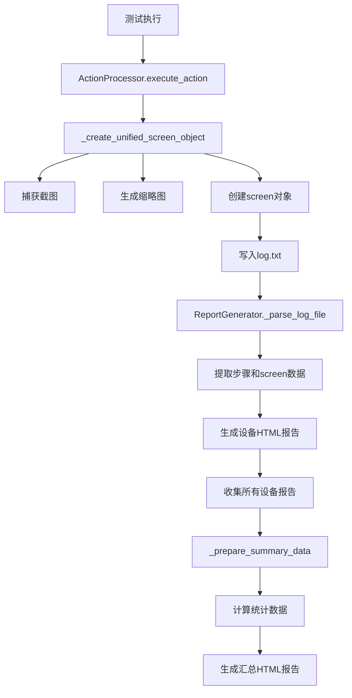

# WFGameAI 报告生成系统详细文档

> 🎯 **专为 AI 工具优化的报告系统完整指南**

## 📋 系统概览

WFGameAI 报告生成系统是一个双层报告架构，包含设备级详细报告和汇总级概览报告。本文档为 AI 开发助手提供完整的系统理解和问题解决指南。

### 核心特性

- ✅ **设备报告**: 详细记录单个设备的测试过程和截图
- ✅ **汇总报告**: 统计所有设备的测试结果和成功率
- ✅ **截图集成**: 完整的截图捕获、处理和显示
- ✅ **模板系统**: 基于 Jinja2 的灵活模板渲染
- ✅ **相对路径**: 正确的目录间链接关系

---

## 🗂️ 目录结构与文件关系

### 完整目录树

```
wfgame-ai-server/
└── staticfiles/reports/
    ├── ui_run/                         # 设备报告根目录
    │   └── WFGameAI.air/
    │       └── log/                    # 设备报告存储目录
    │           └── [设备名_时间戳]/      # 单个设备报告目录
    │               ├── log.html        # 🎯 设备HTML报告
    │               ├── log.txt         # 🎯 原始JSON日志
    │               ├── script.py       # 执行脚本备份
    │               └── log/            # 截图文件目录
    │                   ├── [时间戳].jpg      # 主截图
    │                   └── [时间戳]_small.jpg # 缩略图
    │
    ├── summary_reports/                # 汇总报告存储目录
    │   └── summary_report_[时间戳].html # 🎯 汇总HTML报告
    │
    └── templates/                      # 报告模板目录
        ├── log_template.html           # 设备报告模板
        └── summary_template.html       # 汇总报告模板
```

### 关键文件作用说明

| 文件/目录               | 作用                         | AI 修改频率 | 常见问题                   |
| ----------------------- | ---------------------------- | ----------- | -------------------------- |
| `log.txt`               | 存储设备执行的原始 JSON 日志 | 低          | 格式错误、缺失 screen 字段 |
| `log.html`              | 设备测试的可视化报告         | 中          | 截图不显示、模板渲染失败   |
| `summary_report_*.html` | 所有设备的汇总报告           | 高          | 链接错误、统计数据错误     |
| `[时间戳].jpg`          | 操作步骤的截图               | 低          | 文件不存在、路径错误       |
| `[时间戳]_small.jpg`    | 缩略图用于快速导航           | 低          | 生成失败、尺寸问题         |

---

## 🔄 数据流程与生成逻辑

### 完整数据流



### 关键数据结构

#### 1. log.txt JSON 格式 (AI 必须理解)

```json
{
  "tag": "function",
  "depth": 1,
  "time": 1750313445.97594,
  "data": {
    "name": "touch",
    "call_args": { "pos": [540, 1200] },
    "start_time": 1750313445.97594,
    "ret": true,
    "end_time": 1750313446.97594,
    "screen": {
      "src": "log/screenshot_001.png", // 🎯 HTML模板使用的相对路径
      "_filepath": "/full/path/to/screenshot", // 🎯 文件系统绝对路径
      "thumbnail": "log/thumbnail_001.png", // 🎯 缩略图相对路径
      "resolution": [1080, 2400], // 设备分辨率
      "pos": [540, 1200], // 点击位置坐标
      "vector": [0, 0], // 移动向量
      "confidence": 0.95, // AI检测置信度
      "rect": [490, 1150, 100, 100] // 检测区域 [x, y, w, h]
    }
  }
}
```

#### 2. 设备报告数据结构

```javascript
// log.html 中的 JavaScript 数据
data = {
  steps: [
    // 🎯 测试步骤数组
    {
      title: "点击登录按钮", // 步骤描述
      time: 1750313445.97594, // 执行时间戳
      status: "success", // 执行状态: success/fail
      index: 0, // 步骤索引
      duration: "1.000s", // 执行时长
      code: {
        name: "touch",
        args: [{ key: "pos", value: "[540, 1200]" }],
      },
      screen: {
        // 🎯 截图信息
        src: "log/screenshot_001.png", // 主截图路径
        thumbnail: "log/thumbnail_001.png", // 缩略图路径
        resolution: [1080, 2400], // 分辨率
        pos: [540, 1200], // 点击位置
        confidence: 0.95, // 置信度
        rect: [490, 1150, 100, 100], // 检测框
      },
    },
  ],
  info: {
    name: "TestDevice_2025-06-19", // 设备名称
    title: "设备测试报告", // 报告标题
    devices: {}, // 设备信息
  },
};
```

#### 3. 汇总报告数据结构

```javascript
// summary_report_*.html 中的数据
data = {
  timestamp: "2025-06-19 14:10:45", // 🎯 报告生成时间
  total: 5, // 🎯 总设备数
  success: 4, // 🎯 成功设备数
  passed: 3, // 🎯 通过设备数
  success_rate: "80.0%", // 🎯 成功率(字符串)
  pass_rate: "60.0%", // 🎯 通过率(字符串)
  success_percent: 80.0, // 🎯 成功率(数值,用于进度条)
  pass_percent: 60.0, // 🎯 通过率(数值,用于进度条)
  devices: [
    // 🎯 设备列表
    {
      name: "OnePlus-KB2000_2025-06-19", // 设备名称
      passed: true, // 是否通过测试
      success: true, // 是否执行成功
      report: "../ui_run/WFGameAI.air/log/OnePlus-KB2000_2025-06-19/log.html", // 🎯 设备报告链接(相对路径)
    },
  ],
  scripts: [
    // 🎯 执行的脚本信息
    {
      path: "test_login.json",
      loop_count: 1,
      max_duration: 300,
    },
  ],
};
```

---

## 🔧 核心组件详解

### 1. ActionProcessor (截图处理核心)

**文件位置**: `apps/scripts/action_processor.py`

#### 关键方法: `_create_unified_screen_object`

```python
def _create_unified_screen_object(self, log_dir, pos_list=None, confidence=0.85, rect_info=None):
    """
    创建统一的screen对象，包含截图和元数据

    🎯 AI修改要点:
    1. 确保截图文件实际保存成功
    2. 相对路径格式必须与HTML模板匹配
    3. screen对象必须包含所有必需字段
    4. 缩略图生成不能失败
    """
    try:
        # 生成时间戳文件名
        timestamp = time.time()
        screenshot_filename = f"{int(timestamp * 1000)}.jpg"
        thumbnail_filename = f"{int(timestamp * 1000)}_small.jpg"

        # 🎯 关键: 相对路径用于HTML，绝对路径用于文件操作
        screenshot_relative = f"log/{screenshot_filename}"
        thumbnail_relative = f"log/{thumbnail_filename}"
        screenshot_absolute = os.path.join(log_dir, "log", screenshot_filename)
        thumbnail_absolute = os.path.join(log_dir, "log", thumbnail_filename)

        # 🎯 关键: 确保目录存在
        os.makedirs(os.path.dirname(screenshot_absolute), exist_ok=True)

        # 截图捕获逻辑
        screenshot_success = self._capture_screenshot(screenshot_absolute)
        thumbnail_success = self._create_thumbnail(screenshot_absolute, thumbnail_absolute)

        if not screenshot_success:
            print(f"❌ 截图保存失败: {screenshot_absolute}")
            return None

        # 🎯 返回完整的screen对象
        return {
            "src": screenshot_relative,        # HTML模板使用
            "_filepath": screenshot_absolute,  # 文件系统路径
            "thumbnail": thumbnail_relative,   # 缩略图路径
            "resolution": [1080, 2400],       # 设备分辨率
            "pos": pos_list or [],            # 点击位置
            "vector": [0, 0],                 # 移动向量
            "confidence": confidence,          # 检测置信度
            "rect": rect_info or []           # 检测区域
        }

    except Exception as e:
        print(f"❌ 创建screen对象失败: {str(e)}")
        return None
```

### 2. ReportGenerator (报告生成核心)

**文件位置**: `apps/reports/report_generator.py`

#### 关键方法: `generate_summary_report`

```python
def generate_summary_report(self, device_report_dirs: List[Path], scripts: List[Dict]) -> Optional[Path]:
    """
    生成汇总报告

    🎯 AI修改要点:
    1. 模板路径必须正确
    2. 数据结构必须完整
    3. 文件保存路径要规范
    4. 错误处理要完善
    """
    try:
        print(f"📊 开始生成汇总报告，设备数量: {len(device_report_dirs)}")

        # 🎯 关键: 准备完整的数据结构
        summary_data = self._prepare_summary_data(device_report_dirs, scripts)

        # 🎯 关键: 使用正确的模板路径
        template_path = self.report_manager.reports_root / "templates" / "summary_template.html"
        if not template_path.exists():
            raise FileNotFoundError(f"模板文件不存在: {template_path}")

        # 渲染模板
        html_content = self._render_summary_template(summary_data)

        # 🎯 关键: 使用正确的命名格式和保存路径
        summary_reports_dir = self.report_manager.reports_root / "summary_reports"
        summary_reports_dir.mkdir(parents=True, exist_ok=True)

        timestamp = datetime.now().strftime("%Y-%m-%d-%H-%M-%S")
        summary_file = summary_reports_dir / f"summary_report_{timestamp}.html"

        with open(summary_file, 'w', encoding='utf-8') as f:
            f.write(html_content)

        print(f"✅ 汇总报告生成成功: {summary_file}")
        return summary_file

    except Exception as e:
        print(f"❌ 生成汇总报告失败: {e}")
        return None
```

#### 关键方法: `_prepare_summary_data`

```python
def _prepare_summary_data(self, device_report_dirs: List[Path], scripts: List[Dict]) -> Dict:
    """
    准备汇总报告数据

    🎯 AI修改要点:
    1. 统计计算必须准确
    2. 设备链接路径必须正确
    3. 数据结构必须完整
    4. 字段类型必须匹配模板期望
    """
    try:
        devices = []
        total_devices = len(device_report_dirs)
        success_devices = 0
        passed_devices = 0

        for device_dir in device_report_dirs:
            device_name = device_dir.name

            # 解析设备状态
            steps = self._parse_log_file(device_dir)
            device_steps = len(steps)
            device_success = len([s for s in steps if s.get("status") == "success"])
            device_failed = len([s for s in steps if s.get("status") == "fail"])
            device_passed = device_failed == 0

            # 统计计算
            if device_success > 0:
                success_devices += 1
            if device_passed:
                passed_devices += 1

            # 🎯 关键: 设备报告链接使用正确的相对路径
            # 从 summary_reports/ 到 ui_run/WFGameAI.air/log/{device_name}/
            device_report_link = f"../ui_run/WFGameAI.air/log/{device_name}/log.html"

            devices.append({
                "name": device_name,
                "passed": device_passed,      # 模板需要的字段
                "success": device_success > 0, # 模板需要的字段
                "report": device_report_link,  # 🎯 正确的相对路径
                "steps": device_steps,
                "success_count": device_success,
                "failed_count": device_failed
            })

        # 🎯 关键: 计算各种比率
        success_rate = (success_devices / max(total_devices, 1)) * 100
        pass_rate = (passed_devices / max(total_devices, 1)) * 100

        # 🎯 关键: 返回模板需要的完整数据结构
        return {
            "title": "WFGameAI 测试汇总报告",
            "timestamp": datetime.now().strftime("%Y-%m-%d %H:%M:%S"),
            "generation_time": datetime.now().strftime("%Y-%m-%d %H:%M:%S"),

            # 设备统计
            "total_devices": total_devices,
            "total": total_devices,        # 模板字段
            "success": success_devices,
            "passed": passed_devices,

            # 比率信息(模板需要的格式)
            "success_rate": f"{success_rate:.1f}%",    # 字符串格式
            "pass_rate": f"{pass_rate:.1f}%",          # 字符串格式
            "success_percent": success_rate,           # 数值格式(进度条)
            "pass_percent": pass_rate,                 # 数值格式(进度条)

            # 设备和脚本信息
            "devices": devices,
            "scripts": scripts or [],
            "static_root": self.config.STATIC_URL
        }

    except Exception as e:
        print(f"❌ 准备汇总数据失败: {e}")
        raise e
```

### 3. ReportManager (路径管理)

**文件位置**: `apps/reports/report_manager.py`

```python
class ReportManager:
    """报告路径和配置管理"""

    def __init__(self):
        self.reports_root = Path(settings.BASE_DIR) / "staticfiles" / "reports"

    @property
    def ui_run_dir(self):
        """设备报告存储目录"""
        return self.reports_root / "ui_run" / "WFGameAI.air" / "log"

    @property
    def summary_reports_dir(self):
        """汇总报告存储目录"""
        return self.reports_root / "summary_reports"

    @property
    def templates_dir(self):
        """模板文件目录"""
        return self.reports_root / "templates"
```

---

## 🎯 常见问题与解决方案

### 1. 截图不显示问题

**症状**: HTML 报告中截图显示为空白或 404 错误

**根本原因**:

- screen 对象的 src 字段路径格式错误
- 截图文件没有实际保存成功
- 相对路径与 HTML 模板期望不匹配

**AI 修复方案**:

```python
# 🔧 在 action_processor.py 中修复
def _create_unified_screen_object(self, log_dir, pos_list=None, confidence=0.85, rect_info=None):
    # 确保使用正确的相对路径格式
    screenshot_relative = f"log/{screenshot_filename}"  # ✅ 正确格式
    # 而不是
    screenshot_relative = f"\\log\\{screenshot_filename}"  # ❌ 错误格式

    # 确保文件实际保存
    screenshot_success = self._capture_screenshot(screenshot_absolute)
    if not screenshot_success:
        print(f"❌ 截图保存失败: {screenshot_absolute}")
        return None  # 🎯 必须返回None而不是空对象
```

### 2. 汇总报告设备链接错误

**症状**: 点击汇总报告中的设备链接返回 404 错误

**根本原因**:

- 设备报告链接使用了错误的相对路径
- 目录结构理解错误

**AI 修复方案**:

```python
# 🔧 在 report_generator.py 的 _prepare_summary_data 中修复
def _prepare_summary_data(self, device_report_dirs: List[Path], scripts: List[Dict]) -> Dict:
    for device_dir in device_report_dirs:
        device_name = device_dir.name

        # ✅ 正确的相对路径
        device_report_link = f"../ui_run/WFGameAI.air/log/{device_name}/log.html"

        # ❌ 错误的路径格式
        # device_report_link = f"{device_name}/log.html"  # 缺少目录层级
        # device_report_link = f"/ui_run/WFGameAI.air/log/{device_name}/log.html"  # 绝对路径错误

        devices.append({
            "name": device_name,
            "report": device_report_link  # 🎯 使用正确的相对路径
        })
```

### 3. 汇总报告数据缺失

**症状**: 汇总报告显示空白数据或模板渲染失败

**根本原因**:

- summary_data 缺少模板需要的字段
- 数据类型与模板期望不匹配
- 统计计算错误

**AI 修复方案**:

```python
# 🔧 确保返回完整的数据结构
def _prepare_summary_data(self, device_report_dirs: List[Path], scripts: List[Dict]) -> Dict:
    # 🎯 必须包含模板需要的所有字段
    return {
        "timestamp": datetime.now().strftime("%Y-%m-%d %H:%M:%S"),  # 必需
        "total": total_devices,                                     # 必需
        "success": success_devices,                                 # 必需
        "passed": passed_devices,                                   # 必需
        "success_rate": f"{success_rate:.1f}%",                    # 字符串格式
        "pass_rate": f"{pass_rate:.1f}%",                          # 字符串格式
        "success_percent": success_rate,                           # 数值格式(进度条)
        "pass_percent": pass_rate,                                 # 数值格式(进度条)
        "devices": devices,                                        # 必需
        "scripts": scripts or []                                   # 必需
    }
```

### 4. 模板渲染失败

**症状**: 报告生成过程中模板渲染错误

**根本原因**:

- 模板文件路径不正确
- 模板语法错误
- 传递给模板的数据结构不完整

**AI 修复方案**:

```python
# 🔧 在 report_generator.py 中修复模板路径
def _render_summary_template(self, summary_data: Dict) -> str:
    try:
        # ✅ 使用正确的模板路径查找
        template_path = self.report_manager.reports_root / "templates" / "summary_template.html"

        if not template_path.exists():
            # 🎯 详细的错误信息
            error_msg = f"❌ 模板文件不存在: {template_path}"
            print(error_msg)
            raise FileNotFoundError(error_msg)

        # 创建Jinja2环境
        env = Environment(loader=FileSystemLoader(str(template_path.parent)))
        template = env.get_template(template_path.name)

        # 🎯 传递完整的数据结构
        html_content = template.render(data=summary_data)
        return html_content

    except Exception as e:
        print(f"❌ 渲染模板失败: {e}")
        raise e
```

---

## 📋 AI 修改 Checklist

### 修改前检查

- [ ] 使用 `semantic_search` 收集相关代码上下文
- [ ] 使用 `read_file` 完整理解目标文件
- [ ] 确认问题根本原因而非表面症状
- [ ] 理解数据流和文件依赖关系

### 修改时要求

- [ ] 在原文件原位置直接修改
- [ ] 保持函数接口和返回值类型不变
- [ ] 添加详细的修改注释 (`🔧 AI修改`)
- [ ] 确保修改不破坏现有功能

### 修改后验证

- [ ] 使用 `get_errors` 检查语法错误
- [ ] 运行 `final_end_to_end_verification.py` 验证功能
- [ ] 检查生成的报告文件是否正确
- [ ] 验证设备链接是否能正常访问
- [ ] 确认截图是否正确显示

---

## 🔄 测试与验证流程

### 端到端验证脚本

```python
# 运行完整验证
python final_end_to_end_verification.py

# 检查结果应该显示:
# ✅ ActionProcessor截图集成 - 通过
# ✅ 设备报告生成 - 通过
# ✅ 汇总报告生成 - 通过
```

### 手动验证步骤

1. **检查设备报告生成**:

   ```bash
   # 查看设备报告目录
   ls staticfiles/reports/ui_run/WFGameAI.air/log/

   # 检查截图文件
   ls staticfiles/reports/ui_run/WFGameAI.air/log/[设备名]/log/
   ```

2. **检查汇总报告生成**:

   ```bash
   # 查看汇总报告
   ls staticfiles/reports/summary_reports/

   # 验证最新报告
   cat staticfiles/reports/summary_reports/summary_report_*.html | grep "设备名"
   ```

3. **验证链接正确性**:
   - 打开汇总报告 HTML 文件
   - 点击设备链接确认能正常访问
   - 检查设备报告中的截图是否显示

---

## 🚀 性能优化建议

### 截图处理优化

```python
# 🔧 优化截图处理性能
def _create_unified_screen_object(self, log_dir, pos_list=None, confidence=0.85, rect_info=None):
    try:
        # 🎯 异步处理缩略图生成
        screenshot_success = self._capture_screenshot(screenshot_absolute)
        if screenshot_success:
            # 异步生成缩略图，不阻塞主流程
            threading.Thread(
                target=self._create_thumbnail,
                args=(screenshot_absolute, thumbnail_absolute)
            ).start()

        return screen_object
    except Exception as e:
        # 错误处理...
        pass
```

### 报告生成优化

```python
# 🔧 优化报告生成性能
def generate_summary_report(self, device_report_dirs: List[Path], scripts: List[Dict]) -> Optional[Path]:
    # 🎯 并行处理设备数据
    with ThreadPoolExecutor(max_workers=4) as executor:
        device_futures = [
            executor.submit(self._parse_device_data, device_dir)
            for device_dir in device_report_dirs
        ]

        device_results = [future.result() for future in device_futures]

    # 继续报告生成...
```

---

## 📚 扩展资源

### 相关文档

- `WFGameAI_综合开发规范.md` - 完整开发标准
- `AI_Development_Standards.md` - AI 工具使用规范
- `config.ini` - 路径和配置管理

### 关键配置

```ini
# config.ini 中的重要配置
[reports]
static_url = ../../../../static/
template_dir = staticfiles/reports/templates/
ui_run_dir = staticfiles/reports/ui_run/WFGameAI.air/log/
summary_dir = staticfiles/reports/summary_reports/
```

### 调试技巧

```python
# 🔧 调试报告生成问题
def debug_report_generation():
    # 1. 检查目录权限
    print(f"Reports root exists: {reports_root.exists()}")

    # 2. 检查模板文件
    print(f"Template exists: {template_path.exists()}")

    # 3. 检查数据结构
    print(f"Summary data keys: {summary_data.keys()}")

    # 4. 检查设备数据
    for device in devices:
        print(f"Device: {device['name']}, Report: {device['report']}")
```

---

> 📝 **文档版本**: v2.0
> 🗓️ **最后更新**: 2025-06-19
> 👥 **维护者**: WFGameAI 开发团队
> 🎯 **目标**: 为 AI 开发助手提供完整的报告系统指南

**重要提醒**: 本文档专为 AI 工具优化，请严格按照指南进行修改和验证！
