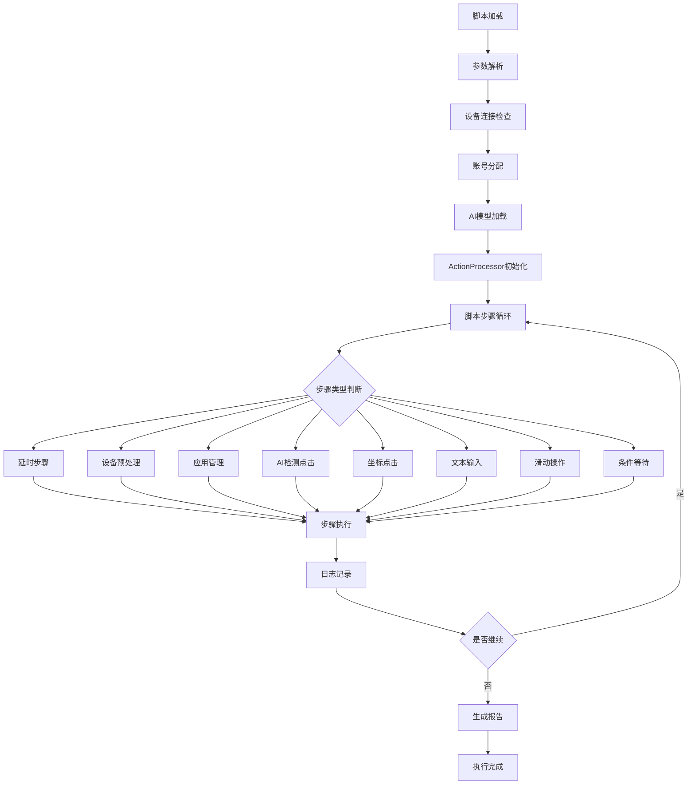

# WFGameAI 自动化测试框架 - 回放功能完整技术文档

> **版本**: 1.0
> **创建日期**: 2025年6月24日
> **作者**: WFGameAI团队
> **文档目的**: 为开发者和AI开发工具提供完整的回放功能技术指南

> **📋 文档导航**
> - **精简版技术文档**: [WFGameAI回放功能技术文档（精简版）](./WFGameAI回放功能技术文档_精简版.md) - 快速上手指南
> - **Action使用手册（精简版）**: [WFGameAI Action 使用手册（精简版）](./WFGameAI_Action_使用手册_精简版.md) - Action快速参考
> - **Action使用手册（完整版）**: [WFGameAI Action 使用手册](./WFGameAI_Action_使用手册.md) - 详细的Action说明

---

## 1. 功能概述

### 1.1 回放功能定义

WFGameAI框架的"回放功能"（Replay Functionality）是核心的自动化测试执行引擎，负责解析和执行预先录制或手动编写的测试脚本，在真实Android设备上重现用户操作序列。

### 1.2 核心特性

- **多设备并行执行**: 支持同时在多台Android设备上执行脚本
- **智能AI检测**: 集成YOLO11m模型进行界面元素识别
- **动作类型丰富**: 支持点击、滑动、输入、等待、应用管理等20+种动作
- **备选点击机制**: AI检测失败时自动切换到坐标点击
- **账号参数化**: 支持设备级账号分配和参数替换
- **实时日志记录**: 生成详细的HTML测试报告
- **UTF-8编码支持**: 完整支持中文和多语言环境

---

## 2. 项目目录结构

### 2.1 核心目录概览

```
WFGameAI/
├── wfgame-ai-server/                     # 后端服务主目录
│   ├── apps/
│   │   ├── scripts/                      # 脚本管理核心模块
│   │   │   ├── replay_script.py          # ⭐ 主回放引擎（精简版）
│   │   │   ├── replay_script_legacy.py   # 传统版本回放引擎
│   │   │   ├── action_processor.py       # ⭐ 动作处理器核心类
│   │   │   ├── enhanced_input_handler.py # 设备脚本回放器
│   │   │   ├── views.py                  # Web API接口
│   │   │   ├── testcase/                 # 测试用例目录
│   │   │   │   ├── *.json               # JSON格式脚本文件
│   │   │   ├── templates/               # 应用模板
│   │   │   ├── account_manager.py       # 账号管理
│   │   │   ├── app_lifecycle_manager.py # 应用生命周期管理
│   │   │   ├── model_loader.py          # AI模型加载
│   │   │   └── ...
│   │   └── ...
│   ├── staticfiles/                      # 静态资源
│   │   ├── pages/                       # Web管理页面
│   │   │   ├── scripts.html             # 脚本管理界面
│   │   │   ├── automation_template.html # 自动化模板
│   │   └── reports/                     # 报告模板
│   ├── config.ini                       # 配置文件
│   └── ...
├── models/                              # AI模型文件
│   └── best.pt                         # YOLO11m检测模型
├── testcase/                           # 额外测试用例目录
├── logs/                               # 执行日志目录
├── reports/                            # 生成的报告目录
└── docs/                               # 文档目录
```

### 2.2 关键文件详解

#### 2.2.1 核心执行文件

| 文件路径 | 功能描述 | 主要特性 |
|---------|----------|----------|
| `replay_script.py` | 主回放引擎（精简版本） | 优化的执行流程、更好的错误处理 |
| `replay_script_legacy.py` | 传统版本回放引擎 | 向后兼容、完整功能集 |
| `action_processor.py` | 动作处理器核心类 | 新旧接口兼容、20+种动作类型 |
| `enhanced_input_handler.py` | 设备脚本回放器 | UI分析、输入处理、坐标计算 |

#### 2.2.2 配置与管理文件

| 文件路径 | 功能描述 |
|---------|----------|
| `config.ini` | 全局配置文件 |
| `account_manager.py` | 账号分配与管理 |
| `app_lifecycle_manager.py` | 应用启动停止管理 |
| `model_loader.py` | AI模型加载与缓存 |
| `views.py` | Web API端点定义 |

---

## 3. 回放功能工作流程

### 3.1 完整执行流程图



### 3.2 详细执行阶段

#### 阶段1: 初始化阶段

1. **配置加载**: 读取`config.ini`获取路径配置
2. **参数解析**: 解析命令行参数（脚本路径、循环次数等）
3. **设备发现**: 通过ADB扫描可用Android设备
4. **模型加载**: 加载YOLO11m检测模型（可选）

#### 阶段2: 设备准备阶段

1. **设备分配**: 为每个设备分配独立的执行进程
2. **账号绑定**: 根据账号池为设备分配测试账号
3. **日志目录**: 为每个设备创建独立的日志目录
4. **ActionProcessor实例化**: 为每个设备创建动作处理器

#### 阶段3: 脚本执行阶段

1. **脚本解析**: 加载JSON格式的测试脚本
2. **步骤遍历**: 按顺序处理每个测试步骤
3. **动作执行**: 通过ActionProcessor执行具体动作
4. **实时记录**: 记录执行日志和截图

#### 阶段4: 报告生成阶段

1. **日志聚合**: 收集所有设备的执行日志
2. **HTML报告**: 生成带截图的详细HTML报告
3. **汇总统计**: 生成执行成功率和时间统计
4. **文件保存**: 保存到指定的报告目录

---

## 4. ActionProcessor 动作处理器架构

### 4.1 类结构概览

```python
class ActionProcessor:
    """Action处理器类 - 支持新旧接口"""

    def __init__(self, device, device_name=None, log_txt_path=None,
                 detect_buttons_func=None, context=None):
        self.device = device                    # ADB设备连接
        self.device_name = device_name          # 设备标识名
        self.log_txt_path = log_txt_path        # 日志文件路径
        self.detect_buttons = detect_buttons_func  # AI检测函数
        self.device_account = None              # 设备分配的账号

    def process_action(self, step, context_or_step_idx, log_dir_or_context=None):
        """统一的动作处理入口 - 支持新旧接口"""
        # 接口兼容性处理
        if isinstance(context_or_step_idx, ActionContext):
            return self._process_action_new(step, context_or_step_idx)
        else:
            return self._process_action_old(step, context_or_step_idx, log_dir_or_context)
```

### 4.2 支持的动作类型

> **📖 详细参考**: 所有Action类型的完整说明、参数详解和使用示例请参考 → [WFGameAI Action 使用手册](./WFGameAI_Action_使用手册.md)

ActionProcessor支持20+种动作类型，按功能分为以下几个主要类别：

#### 4.2.1 基础操作类

- **`delay`** - 时间延迟等待
- **`device_preparation`** - 设备初始化设置
- **`app_start` / `app_stop`** - 应用生命周期管理
- **`log`** - 自定义日志记录

> **🔗 详细说明**: [基础操作类 - Action使用手册](./WFGameAI_Action_使用手册.md#-基础操作类)

#### 4.2.2 交互操作类

- **`click`** - AI智能检测点击
- **`click_target`** - 目标选择器点击
- **`input`** - 文本输入（支持变量替换）
- **`checkbox`** - 复选框操作
- **`swipe`** - 屏幕滑动操作

> **🔗 详细说明**: [UI元素操作类 - Action使用手册](./WFGameAI_Action_使用手册.md#-ui元素操作类)

#### 4.2.3 等待机制类

- **`wait_if_exists`** - 条件等待（元素出现后消失）
- **`wait_for_disappearance`** - 等待元素消失
- **`wait`** - 通用等待机制

> **🔗 详细说明**: [智能检测类 - Action使用手册](./WFGameAI_Action_使用手册.md#-智能检测类)

#### 4.2.4 高级自动化类

- **`auto_login`** - 完整自动登录流程

> **🔗 使用示例**: [完整脚本示例 - Action使用手册](./WFGameAI_Action_使用手册.md#-完整脚本示例)

### 4.3 接口兼容性设计

ActionProcessor采用双接口设计，确保向后兼容：

#### 4.3.1 新接口（推荐）
```python
# 返回ActionResult对象
context = ActionContext(device=device, log_txt_path=log_path, screenshot_dir=screenshot_dir)
result = action_processor.process_action(step, context)
if result.success:
    print(f"执行成功: {result.message}")
```

#### 4.3.2 旧接口（兼容）
```python
# 返回元组 (success, has_executed_steps, should_continue)
success, has_executed_steps, should_continue = action_processor.process_action(step, step_idx, log_dir)
```

---

## 5. 脚本格式与结构

### 5.1 JSON脚本格式

WFGameAI使用JSON格式存储测试脚本，具有良好的可读性和可编辑性：

```json
{
  "type": "script",
  "name": "示例测试脚本",
  "description": "完整的功能测试流程",
  "author": "WFGameAI",
  "date": "2025-12-16",
  "steps": [
    {
      "step": 1,
      "class": "delay",
      "params": {
        "seconds": 3
      },
      "remark": "等待应用启动"
    },
    {
      "step": 2,
      "action": "click",
      "class": "login-button",
      "confidence": 0.8,
      "timestamp": "2025-12-16 10:00:00.000000",
      "remark": "点击登录按钮"
    },
    {
      "step": 3,
      "action": "input",
      "text": "${account:username}",
      "target_selector": {
        "placeholder": "请输入用户名",
        "clear_previous_text": true
      },
      "confidence": 0.95,
      "remark": "输入用户名"
    }
  ]
}
```

### 5.2 脚本字段说明

#### 5.2.1 元数据字段

| 字段名 | 类型 | 必选 | 描述 |
|--------|------|------|------|
| `type` | string | 否 | 脚本类型标识 |
| `name` | string | 否 | 脚本名称 |
| `description` | string | 否 | 脚本描述 |
| `author` | string | 否 | 脚本作者 |
| `date` | string | 否 | 创建日期 |
| `steps` | array | 是 | 执行步骤数组 |

#### 5.2.2 步骤字段说明

| 字段名 | 类型 | 必选 | 描述 | 示例 |
|--------|------|------|------|------|
| `step` | number | 是 | 步骤序号 | `1`, `1.5`, `2` |
| `class` | string | 部分 | 元素类别或步骤类型 | `"login-button"`, `"delay"` |
| `action` | string | 部分 | 动作类型 | `"click"`, `"input"`, `"swipe"` |
| `remark` | string | 推荐 | 步骤说明 | `"点击登录按钮"` |
| `confidence` | number | 否 | AI检测置信度 | `0.8` (0-1之间) |
| `timestamp` | string | 否 | 录制时间戳 | `"2025-12-16 10:00:00.000000"` |

### 5.3 特殊参数说明

> **📖 完整参数指南**: 所有Action参数的详细说明和使用示例请参考 → [WFGameAI Action 使用手册](./WFGameAI_Action_使用手册.md#-快速查找)

#### 5.3.1 账号参数化

脚本支持账号参数的动态替换，实现多设备差异化测试：

```json
{
  "action": "input",
  "text": "${account:username}",  // 自动替换为分配的用户名
  "target_selector": {
    "placeholder": "请输入用户名"
  }
}
```

```json
{
  "action": "input",
  "text": "${account:password}",  // 自动替换为分配的密码
  "target_selector": {
    "placeholder": "请输入密码"
  }
}
```

> **🔗 详细说明**: [文本输入类 - Action使用手册](./WFGameAI_Action_使用手册.md#-文本输入类)

#### 5.3.2 target_selector选择器

复杂的元素选择器，支持多种匹配方式：

```json
{
  "target_selector": {
    "text_hints": ["登录", "进入游戏", "立即登录"],
    "resource_id_keywords": ["login", "enter", "submit"],
    "class_types": ["android.widget.Button", "android.widget.TextView"],
    "content_desc_keywords": ["登录", "进入"],
    "placeholder": "请输入用户名",
    "clear_previous_text": true,
    "skip_if_not_found": false
  }
}
```

### 5.4 常用脚本示例

#### 5.4.1 应用启动脚本

```json
{
  "steps": [
    {
      "step": 1,
      "class": "device_preparation",
      "remark": "设备预处理",
      "params": {
        "check_usb": true,
        "setup_wireless": false,
        "configure_permissions": true,
        "handle_screen_lock": true,
        "setup_input_method": true
      }
    },
    {
      "step": 2,
      "class": "app_start",
      "remark": "启动应用",
      "params": {
        "app_name": "测试应用",
        "package_name": "com.example.app",
        "handle_permission": true,
        "permission_wait": 15,
        "allow_permission": true
      }
    }
  ]
}
```

#### 5.4.2 滑动操作脚本

```json
{
  "steps": [
    {
      "step": 1,
      "action": "swipe",
      "start_x": 500,
      "start_y": 800,
      "end_x": 500,
      "end_y": 400,
      "duration": 500,
      "remark": "向上滑动"
    },
    {
      "step": 2,
      "action": "swipe",
      "start_x": 200,
      "start_y": 600,
      "end_x": 800,
      "end_y": 600,
      "duration": 300,
      "remark": "向右滑动"
    }
  ]
}
```

---

## 6. AI检测与备选机制

### 6.1 AI检测流程

WFGameAI集成了YOLO11m模型进行界面元素的智能识别：

```python
def detect_buttons(frame, target_class=None):
    """
    AI检测函数

    Args:
        frame: OpenCV格式的屏幕截图
        target_class: 目标元素类别

    Returns:
        tuple: (success, (x, y, confidence)) 或 (False, (None, None, None))
    """
    # 1. 模型推理
    results = model(frame)

    # 2. 结果过滤
    for result in results:
        if result.class_name == target_class and result.confidence > threshold:
            return True, (result.x, result.y, result.confidence)

    # 3. 未找到目标
    return False, (None, None, None)
```

### 6.2 备选点击机制

当AI检测失败时，系统会自动切换到相对坐标点击：

```python
def _handle_fallback_click(self, step, step_idx, log_dir):
    """处理备选点击机制"""
    if "relative_x" not in step or "relative_y" not in step:
        return False, False, False

    # 获取屏幕分辨率
    screenshot = get_device_screenshot(self.device)
    height, width = screenshot.shape[:2]

    # 计算绝对坐标
    rel_x = float(step["relative_x"])
    rel_y = float(step["relative_y"])
    abs_x = int(width * rel_x)
    abs_y = int(height * rel_y)

    # 执行点击
    self.device.shell(f"input tap {abs_x} {abs_y}")

    return True, True, True
```

### 6.3 检测优先级策略

1. **AI检测优先**: 首先尝试通过AI模型识别目标元素
2. **坐标备选**: AI失败时使用记录的相对坐标
3. **容错处理**: 多次重试和错误恢复机制

---

## 7. 多设备并行执行

### 7.1 并行架构设计

```python
def main():
    # 1. 扫描可用设备
    devices = get_devices()

    # 2. 为每个设备创建独立进程
    processes = []
    for i, device in enumerate(devices):
        process = multiprocessing.Process(
            target=replay_device,
            args=(device, scripts, screenshot_queue, action_queue,
                  click_queue, stop_event, f"device_{i}", log_dir)
        )
        processes.append(process)
        process.start()

    # 3. 等待所有进程完成
    for process in processes:
        process.join()
```

### 7.2 账号分配策略

```python
def allocate_device_account(device_serial, account_pool):
    """
    为设备分配账号

    Args:
        device_serial: 设备序列号
        account_pool: 账号池列表

    Returns:
        tuple: (username, password) 或 None
    """
    if not account_pool:
        return None

    # 基于设备序列号的哈希分配
    device_index = hash(device_serial) % len(account_pool)
    return account_pool[device_index]
```

### 7.3 日志隔离机制

每个设备拥有独立的日志目录和文件：

```
logs/
├── device_OnePlus-KB2000_2025-12-16-14-30-21/
│   ├── log.txt                    # 执行日志
│   ├── screenshots/               # 截图目录
│   └── report.html               # 设备报告
├── device_HUAWEI-JAD-AL00_2025-12-16-14-30-25/
│   ├── log.txt
│   ├── screenshots/
│   └── report.html
└── summary_report_2025-12-16-14-30-xx.html  # 汇总报告
```

---

## 8. 日志记录与报告生成

### 8.1 日志格式规范

WFGameAI采用JSON Lines格式记录详细的执行日志：

```json
{
  "tag": "function",
  "depth": 1,
  "time": 1734336000.123,
  "data": {
    "name": "touch",
    "call_args": {"v": [500, 300]},
    "start_time": 1734336000.120,
    "ret": [500, 300],
    "end_time": 1734336000.125,
    "desc": "点击登录按钮",
    "title": "#1 点击登录按钮",
    "screen": {
      "src": "screenshots/1734336000123_step1.jpg",
      "_filepath": "screenshots/1734336000123_step1.jpg",
      "thumbnail": "screenshots/1734336000123_step1_small.jpg",
      "resolution": [1080, 1920],
      "pos": [[500, 300]],
      "confidence": 0.85,
      "rect": [{"left": 450, "top": 250, "width": 100, "height": 100}]
    }
  }
}
```

### 8.2 日志字段说明

| 字段名 | 类型 | 描述 |
|--------|------|------|
| `tag` | string | 日志类型标识 |
| `depth` | number | 调用深度 |
| `time` | number | 时间戳 |
| `data.name` | string | 操作名称 |
| `data.call_args` | object | 调用参数 |
| `data.ret` | any | 返回结果 |
| `data.screen` | object | 截图信息 |
| `data.screen.src` | string | 截图文件路径 |
| `data.screen.pos` | array | 点击坐标 |
| `data.screen.confidence` | number | AI检测置信度 |

### 8.3 HTML报告生成

系统会将JSON日志转换为可视化的HTML报告：

1. **步骤时序**: 按时间顺序展示执行步骤
2. **截图展示**: 每个关键步骤的屏幕截图
3. **执行统计**: 总体成功率、耗时统计
4. **错误分析**: 失败步骤的详细信息

### 8.4 报告目录结构

```
reports/
├── 2025-12-16/                           # 按日期分组
│   ├── summary_report_2025-12-16-14-31-xx.html  # 汇总报告
│   ├── OnePlus-KB2000_2025-12-16-14-31-21/      # 设备报告
│   │   ├── log.txt                               # 原始日志
│   │   ├── report.html                           # 设备报告
│   │   └── screenshots/                          # 截图文件
│   │       ├── 1734336000123_step1.jpg
│   │       ├── 1734336000123_step1_small.jpg     # 缩略图
│   │       └── ...
│   └── latest_report.html                        # 最新报告快捷方式
```

---

## 9. Web API接口

### 9.1 脚本管理API

#### 9.1.1 获取脚本列表

```http
POST /api/scripts/
Content-Type: application/json

{}
```

**响应示例**:
```json
{
  "scripts": [
    {
      "filename": "login_test.json",
      "path": "testcase/login_test.json",
      "step_count": 5,
      "created": "2025-12-16 10:00:00",
      "category": "登录流程",
      "include_in_log": true
    }
  ]
}
```

#### 9.1.2 执行脚本回放

```http
POST /api/scripts/replay/
Content-Type: application/json

{
  "scripts": [
    {
      "path": "testcase/login_test.json",
      "loop_count": 1,
      "max_duration": 300
    }
  ],
  "show_screens": true
}
```

#### 9.1.3 导入脚本文件

```http
POST /api/scripts/import/
Content-Type: multipart/form-data

file: [JSON文件]
category: 1
description: "导入的测试脚本"
```

### 9.2 报告查询API

#### 9.2.1 获取报告列表

```http
GET /api/scripts/reports/
```

**响应示例**:
```json
{
  "reports": [
    {
      "filename": "summary_report_2025-12-16-14-31-xx.html",
      "created": "2025-12-16 14:31:00",
      "url": "/reports/2025-12-16/summary_report_2025-12-16-14-31-xx.html"
    }
  ]
}
```

---

## 10. 配置管理

### 10.1 config.ini配置文件

```ini
[paths]
project_root = C:\Users\Administrator\PycharmProjects\WFGameAI
testcase_dir = C:\Users\Administrator\PycharmProjects\WFGameAI\wfgame-ai-server\apps\scripts\testcase
model_path = C:\Users\Administrator\PycharmProjects\WFGameAI\models\best.pt
log_dir = C:\Users\Administrator\PycharmProjects\WFGameAI\logs
report_dir = C:\Users\Administrator\PycharmProjects\WFGameAI\reports

[ai]
model_enabled = true
confidence_threshold = 0.7
device_timeout = 30

[execution]
default_loop_count = 1
max_parallel_devices = 4
screenshot_enabled = true
```

### 10.2 环境变量支持

```bash
# Python环境路径
export PYTHON_PATH="F:\QA\Software\anaconda3\envs\py39_yolov10\python.exe"

# 项目根目录
export WFGAME_PROJECT_ROOT="C:\Users\Administrator\PycharmProjects\WFGameAI"

# 模型文件路径
export WFGAME_MODEL_PATH="C:\Users\Administrator\PycharmProjects\WFGameAI\models\best.pt"
```

---

## 11. 命令行使用指南

### 11.1 基础命令

#### 11.1.1 单脚本回放

```bash
# 基础回放
python replay_script.py --script testcase/login_test.json

# 带屏幕显示
python replay_script.py --show-screens --script testcase/login_test.json

# 循环执行
python replay_script.py --script testcase/login_test.json --loop-count 3

# 限制执行时间
python replay_script.py --script testcase/login_test.json --max-duration 300
```

#### 11.1.2 多脚本顺序执行

```bash
python replay_script.py \
  --show-screens \
  --script testcase/app_start.json --loop-count 1 \
  --script testcase/login_test.json --max-duration 60 \
  --script testcase/logout_test.json
```

### 11.2 参数说明

| 参数名 | 短参数 | 描述 | 示例 |
|--------|--------|------|------|
| `--script` | `-s` | 指定脚本文件路径 | `--script testcase/login.json` |
| `--show-screens` | 无 | 显示设备屏幕窗口 | `--show-screens` |
| `--loop-count` | `-l` | 脚本循环执行次数 | `--loop-count 3` |
| `--max-duration` | `-d` | 最大执行时间(秒) | `--max-duration 300` |

---

## 12. 常见问题与故障排除

### 12.1 设备连接问题

#### 问题1: 设备无法检测
```bash
# 检查ADB连接
adb devices

# 重启ADB服务
adb kill-server
adb start-server
```

#### 问题2: 权限不足
```bash
# 确保开启USB调试
# 在设备上允许USB调试授权
```

### 12.2 脚本执行问题

#### 问题1: AI检测失败率高

**解决方案**:
1. 检查模型文件是否存在
2. 调整confidence阈值
3. 更新target_class名称
4. 使用相对坐标备选机制

#### 问题2: 文本输入失败

**解决方案**:
1. 检查输入法设置
2. 确认target_selector正确
3. 验证文本编码（UTF-8）

### 12.3 日志与报告问题

#### 问题1: 报告生成失败

**解决方案**:
1. 检查日志目录权限
2. 确保磁盘空间充足
3. 验证HTML模板文件

#### 问题2: 截图保存失败

**解决方案**:
1. 检查screenshots目录
2. 确认设备屏幕正常
3. 验证文件命名规范

---

## 13. 扩展开发指南

### 13.1 添加新的动作类型

#### 步骤1: 在ActionProcessor中添加处理方法

```python
def _handle_custom_action(self, step, step_idx):
    """处理自定义动作"""
    custom_param = step.get("custom_param", "default_value")

    # 实现自定义逻辑
    result = self.perform_custom_operation(custom_param)

    # 记录日志
    timestamp = time.time()
    log_entry = {
        "tag": "function",
        "depth": 1,
        "time": timestamp,
        "data": {
            "name": "custom_action",
            "call_args": {"custom_param": custom_param},
            "start_time": timestamp,
            "ret": result,
            "end_time": timestamp + 1
        }
    }
    self._write_log_entry(log_entry)

    return True, True, True
```

#### 步骤2: 在_process_action_old中添加分支

```python
def _process_action_old(self, step, step_idx, log_dir):
    # ... 现有代码 ...
    elif step_action == "custom_action":
        return self._handle_custom_action(step, step_idx)
    # ... 现有代码 ...
```

### 13.2 自定义检测模型

```python
def custom_detect_function(frame, target_class=None):
    """自定义检测函数"""
    # 实现自定义检测算法
    # 返回格式: (success, (x, y, confidence))

    # 示例：基于模板匹配
    template = load_template(target_class)
    result = cv2.matchTemplate(frame, template, cv2.TM_CCOEFF_NORMED)
    min_val, max_val, min_loc, max_loc = cv2.minMaxLoc(result)

    if max_val > 0.8:
        return True, (max_loc[0], max_loc[1], max_val)
    else:
        return False, (None, None, None)
```

### 13.3 添加新的选择器类型

```python
def custom_target_selector(elements, selector):
    """自定义目标选择器"""
    custom_attribute = selector.get("custom_attribute", "")

    for element in elements:
        if element.get("custom_field") == custom_attribute:
            return element

    return None
```

---

## 14. 性能优化建议

### 14.1 执行性能优化

1. **并行设备数量**: 根据硬件性能调整max_parallel_devices
2. **截图频率**: 在不影响调试的情况下减少截图
3. **AI模型**: 使用量化模型减少内存占用
4. **日志级别**: 生产环境减少详细日志

### 14.2 内存优化

```python
# 1. 及时释放截图内存
screenshot = None
del screenshot

# 2. 限制队列大小
screenshot_queue = queue.Queue(maxsize=10)

# 3. 定期清理临时文件
import gc
gc.collect()
```

### 14.3 稳定性优化

1. **异常处理**: 完善的try-catch机制
2. **重试机制**: 关键操作的自动重试
3. **超时设置**: 防止操作无限等待
4. **资源清理**: 确保进程和连接的正确释放

---

## 15. 版本更新记录

### v1.0 (2025-12-16)
- ✅ 初始版本发布
- ✅ 完整的回放功能架构
- ✅ ActionProcessor双接口设计
- ✅ 多设备并行执行支持
- ✅ AI检测与备选机制
- ✅ UTF-8编码支持
- ✅ 详细HTML报告生成

---

## 16. 结语

WFGameAI回放功能作为整个自动化测试框架的核心引擎，提供了完整、稳定、高效的测试脚本执行能力。通过本文档，开发者和AI开发工具可以：

1. **深入理解**: 回放功能的完整架构和工作原理
2. **快速上手**: 通过示例和API快速集成和使用
3. **定制扩展**: 根据具体需求添加新功能
4. **故障排除**: 快速定位和解决常见问题

框架设计充分考虑了可扩展性、兼容性和易用性，为移动应用自动化测试提供了强大的技术支撑。

---

**联系方式**
- 项目地址: `C:\Users\Administrator\PycharmProjects\WFGameAI`
- 技术支持: WFGameAI团队
- 文档版本: v1.0
- 最后更新: 2025年12月16日
